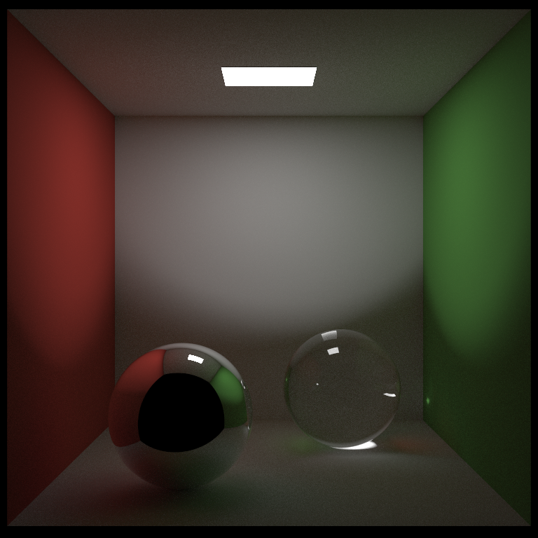

# Basic Pathtracer

A small standalone C++ path tracer that renders a Cornell box with a mirror sphere,
a glass sphere, and a rectangular area light

The code is kept in one file on purpose so the rendering loop, materials, ray
intersections, sampling, and image output are easy to follow

## Build

```sh
clang++ -std=c++17 -O3 -DNDEBUG -D_USE_MATH_DEFINES cornell_spheres.cpp -o cornell_spheres
```

On Windows, building with Clang can use:

```powershell
clang++ -std=c++17 -O3 -DNDEBUG -D_USE_MATH_DEFINES cornell_spheres.cpp -o cornell_spheres.exe
```

## Render

```sh
./cornell_spheres 800 800 512 cornell_spheres.ppm
```

To convert the PPM output to PNG:

```sh
ffmpeg -y -i cornell_spheres.ppm cornell_spheres.png
```

Arguments are:

```txt
cornell_spheres [width height samples_per_pixel output.ppm]
```

The repository includes this reference render:


